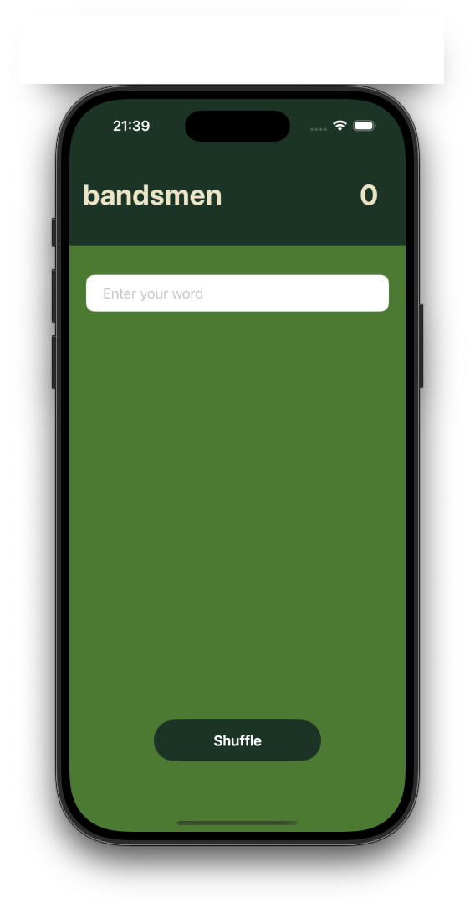
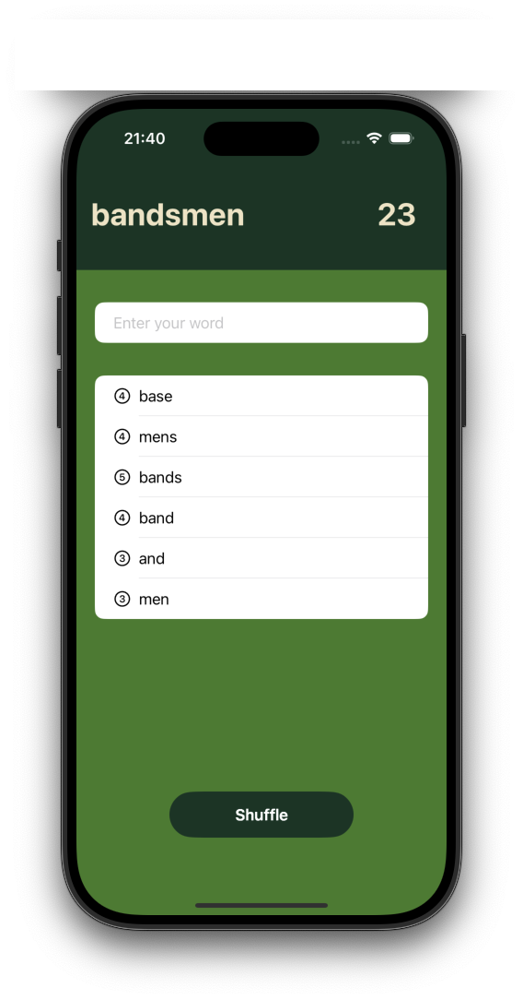

# Scrabble Game in SwiftUI

## Description
This is a Scrabble-inspired word game built using SwiftUI. The game challenges users to create words from a root word (displayed at the top of the screen) and earn points based on valid words formed. It includes error handling, a dynamic score counter, and a shuffle button that resets the game by changing the root word and resetting the score.

## Technologies Used
- **SwiftUI**: The user interface is designed using SwiftUI’s declarative syntax and state management system.
- **Swift**: Core game logic including word validation, score calculation, and state management is implemented in Swift.

## Key Features
1. **Root Word Display**: A root word is shown, and players must form valid words using the letters from this root word.
2. **Word Validation**: Players input words, and the app checks if each word can be formed from the root word’s letters.
3. **Score Calculation**: Players earn points based on the length of the word they form. The score is updated in real-time.
4. **Shuffle Button**: A button that reshuffles the root word and resets the score, allowing the game to continue with new word challenges.
5. **Error Handling**: If a player enters an invalid word or tries to reuse a word, an error message is displayed.
6. **Dynamic UI**: The UI dynamically updates as the player interacts with the app, reflecting changes in the used words, score, and input field.

## Inspiration
This project was inspired by Paul Hudson's "Hacking with Swift" tutorials, which provided the foundation for building the app using SwiftUI. However, this is an enhanced version where additional features and improvements have been added, including a shuffle button to reset the game and more advanced error handling. The game’s core mechanics and UI are based on the tutorial...
